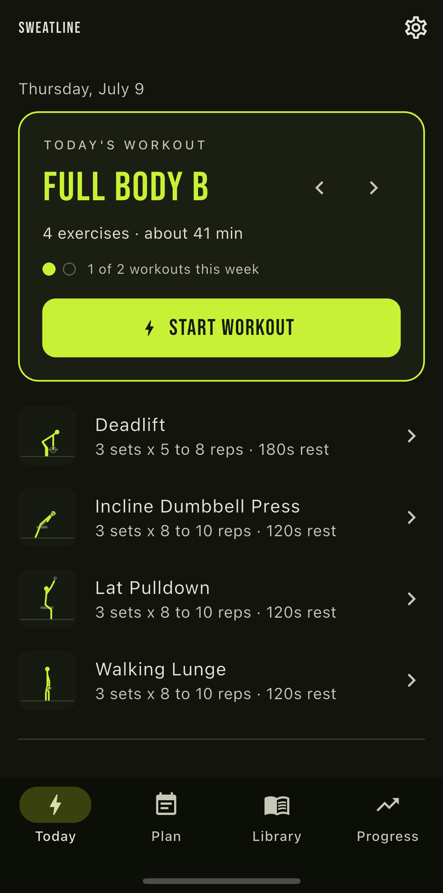
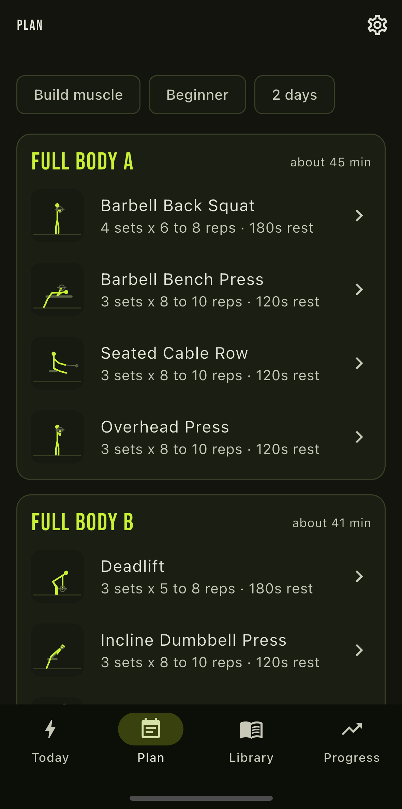
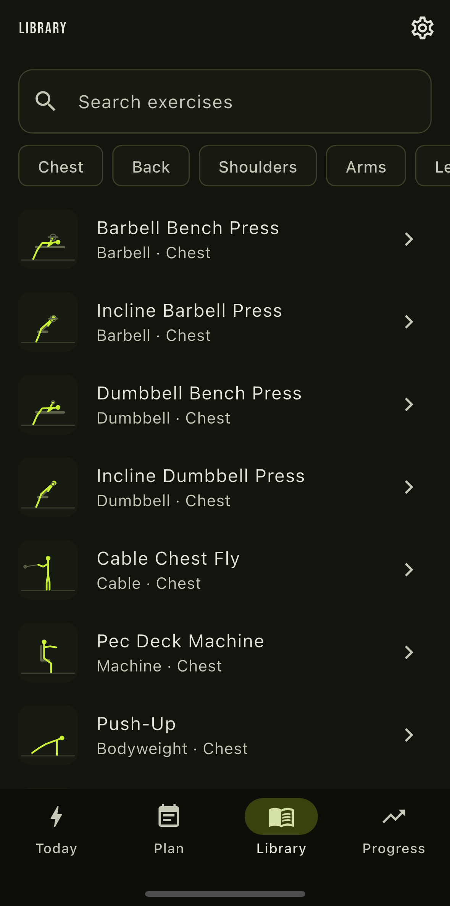
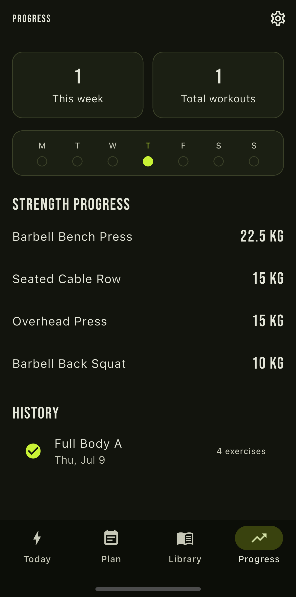
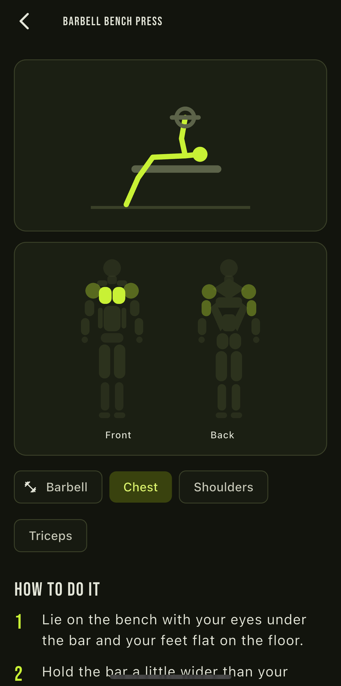
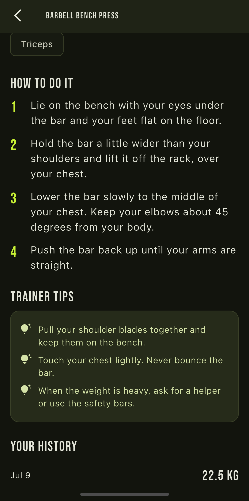
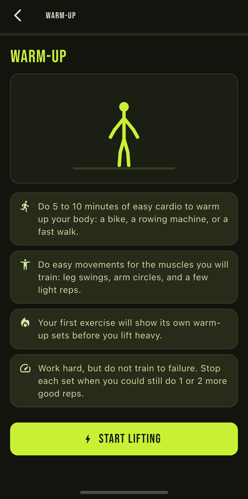
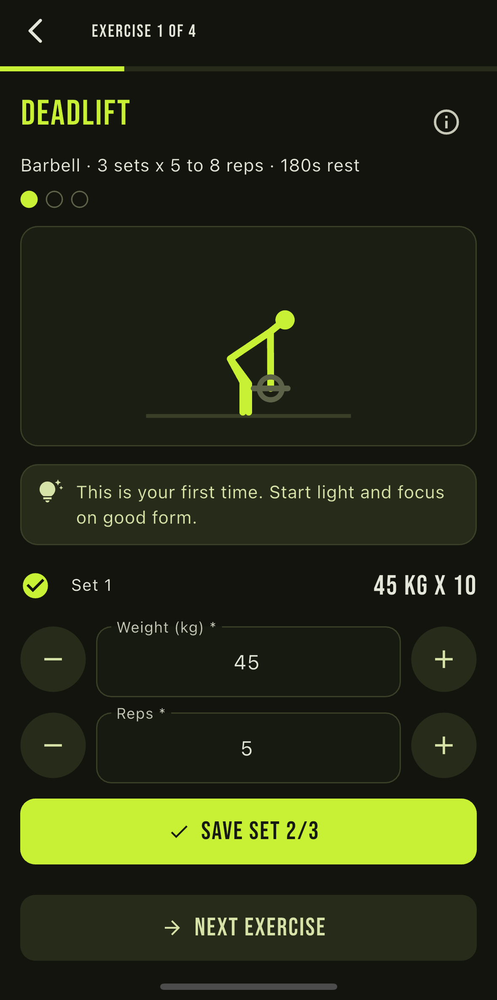
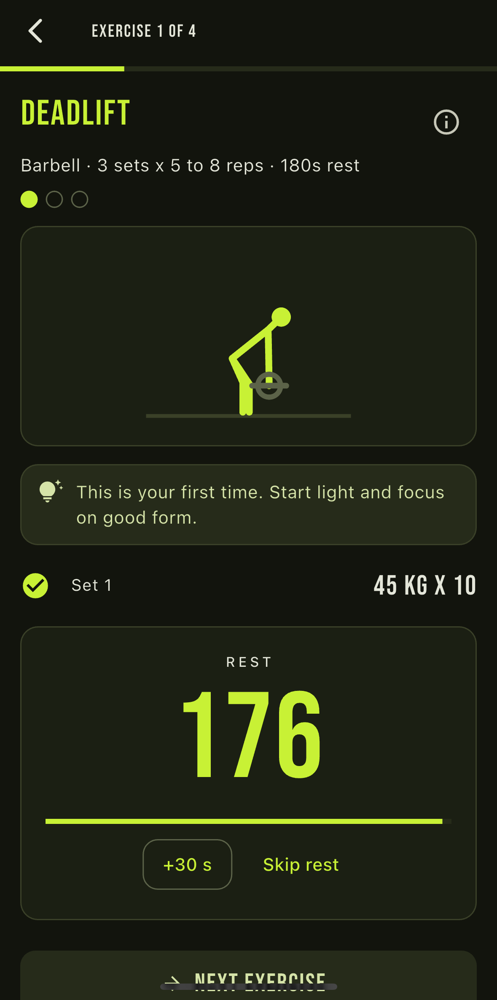
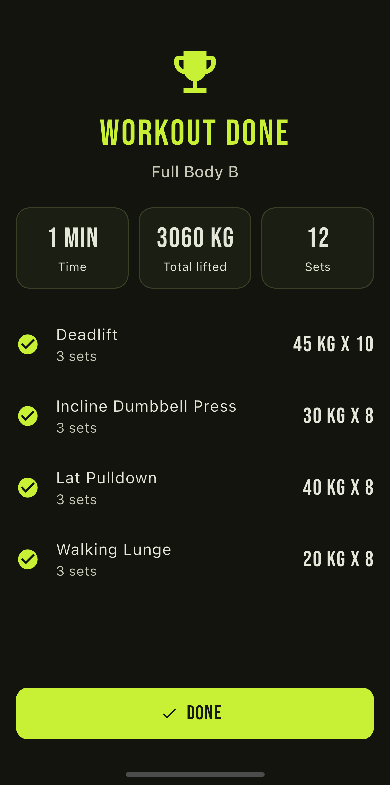

# Sweatline

Personal training app for iOS and Android, built with Flutter. It builds a
weekly gym plan the way a coach would, guides you through every session, and
tracks your strength progress. Everything runs offline; no account, no
backend, no data leaves the device.

## Screenshots

<table>
  <tr>
    <td></td>
    <td></td>
    <td></td>
    <td></td>
    <td></td>
  </tr>
  <tr>
    <td align="center">Today</td>
    <td align="center">Plan</td>
    <td align="center">Library</td>
    <td align="center">Progress</td>
    <td align="center">Exercise detail</td>
  </tr>
  <tr>
    <td></td>
    <td></td>
    <td></td>
    <td></td>
    <td></td>
  </tr>
  <tr>
    <td align="center">Instructions</td>
    <td align="center">Warmup</td>
    <td align="center">Set logging</td>
    <td align="center">Rest timer</td>
    <td align="center">Summary</td>
  </tr>
</table>

## Features

- **Built-in trainer**: a three-question quiz (goal, experience, frequency)
  generates a plan from proven splits: full body, push/pull/legs,
  upper/lower, or PPL twice for 6 days a week.
- **Real programming**: compound lifts first with warm-up sets, heavier
  loads, and longer rests; isolation work with higher reps; rep ranges and
  rest periods tuned per goal; double-progression weight suggestions.
- **Guided workouts**: one exercise at a time, target weight from your last
  session, set logging, and a wall-clock rest timer with a haptic buzz.
  The screen stays awake, and an in-progress workout survives an app kill
  (auto-saved draft with resume).
- **Exercise encyclopedia**: 57 exercises with equipment, animated
  movement pictograms (a figure tweening between start and end position,
  drawn in code from pose data in `lib/exercise_poses.dart`), muscle maps
  (front/back diagrams with primary and secondary muscles highlighted),
  step-by-step instructions, and trainer form cues.
- **Progress tracking**: weekly and total stats, per-exercise strength
  trends, and full session history.
- **Settings**: kg/lb display units (storage is always kg), light/dark/system
  theme, clipboard backup and restore.

## Development

```sh
flutter pub get
flutter gen-l10n     # generates lib/l10n/app_localizations*.dart
flutter run
```

Quality gates (all must pass, CI enforces them):

```sh
dart format lib test
flutter analyze
flutter test --exclude-tags golden
```

### App icon

`assets/icon/app_icon.png` is rendered by a golden test, then fanned out to
all platform sizes:

```sh
flutter test --update-goldens --tags golden test/tools/app_icon_test.dart
dart run flutter_launcher_icons
```

### Release signing

Android release builds require a local `android/key.properties` file. Copy
`android/key.properties.example`, fill in the keystore values, and keep the
real file out of git.

## Architecture

Single local store (`lib/store.dart`, a `ChangeNotifier` over SQLite via
`lib/database.dart`) exposed through an `InheritedNotifier`. Workout history
is normalized across `sessions` / `exercise_logs` / `set_logs` tables, so
logging a workout is a few row inserts rather than a rewrite of the whole
history; plan, in-progress draft, and settings live as rows in a small
`meta` key-value table. Domain models in `lib/models.dart` serialize to JSON
with stable string keys; all user-facing strings go through
`flutter gen-l10n` (`lib/l10n/app_en.arb`). The exercise library and plan
templates are code-defined seed data in `lib/exercise_library.dart` and
`lib/plan_generator.dart`.

The store keeps a synchronous public API by loading everything into memory
once at `AppStore.open` and writing incrementally. The schema version is
SQLite's `PRAGMA user_version`. Corrupt meta values are dropped, never crash
the app. Weights are stored in kilograms and converted at the display
boundary.

## Privacy

All data stays on the device in app-local storage. The app makes no network
requests.
